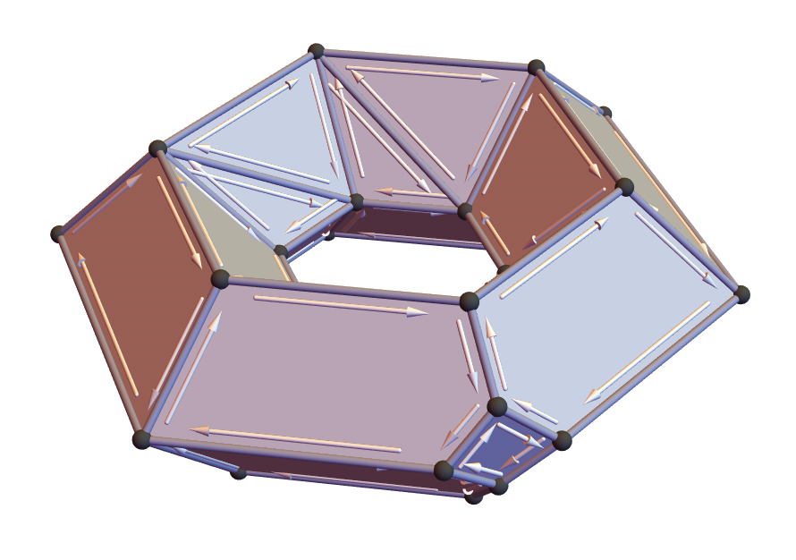

# HalfedgeMesh.m



This _Mathematica_ package provides an implementation of the halfedge mesh data structure aimed at quick prototyping and concise, legible mesh navigation code.  It is not intended for large-scale/high-performance mesh processing, nor is it well-packaged/encapsulated, since it assumes a single mesh (and defines functions that pollute the global namespace).

Its basic function is to convert standard vertex-face connectivity to halfedge connectivity.  It also provides helper functions that make it easy to access mesh elements, using syntax like

```Mathematica
oppositeEdge = v//he//next//edge
```

## Usage

### Loading

The package can be loaded via

```Mathematica
Import["HalfedgeMesh.m"];
```

(Note that the path must be set so that the package is accessible.  To load it from the local directory of the notebook, you can first write `SetDirectory[NotebookDirectory[]];`.)

### Converting to halfedge

The main method in the package is `BuildHalfedge[polygons]`, which builds halfedge connectivity information and associated helper functions.  For instance, suppose we define a small mesh of two triangles inline as

```Mathematica
vertexCoordinates = {{1, 1, 0}, {0, 1, 0}, {0, 0, 0}, {-1, 0, 0}};
polygons = {{1, 2, 3}, {3, 2, 4}};
```

We can then convert to halfedge connectivity via

```Mathematica
{mesh, twin, next, vertex, edge, face, he} = BuildHalfedge[polygons];
```

From here, usage looks much like any other halfedge mesh data structure.  For instance, to compute the surface area we could write

```Mathematica
(* Compute the mean edge length by accumulating the total *)
(* edge length, then dividing by the number of edges. *)

totalLength = 0;

Do[ (* iterate over edges e *)
  h = e // he; (*
  get one of the halfedges h of e *)

  (* get the two vertices v1,v2 of e *)
  v1 = h // vertex;
  v2 = h // twin // vertex;

  (* get the locations of the two endpoints *)

  p1 = vertexCoordinates[[v1]];
  p2 = vertexCoordinates[[v2]];

  (* add the length to our total *)
  totalLength += Norm[p1 - p2];
  ,
  {e, mesh["edges"]}
];

meanEdgeLength = totalLength/Length[mesh["edges"]]
```

### Utility functions

The HalfedgeMesh package also defines several utility functions.  Note that, in order to keep function invocation concise, most of these functions assume the existence of a halfedge mesh named `mesh` (as built by `BuildHalfedge`), and that the element helper functions have the same names as above (`twin, next, vertex, edge, face, he`).  They also assume that there is a list of vertex coordinates named `vertexCoordinates` (as built by `loadPolygonalOBJ`).

- `index[x]` — Returns the index of a vertex, edge, or face `x`.  Like the element navigation helpers, it is often convenient to use this function in postfix form, e.g., `i = e//he//vertex//index` gets the index of one of the endpoints of edge `e`.

- `position[v]` — Returns the coordinates of vertex `v`.  Note that, like the element helper functions, it is often convenient to call this function in postfix form, e.g., `e//he//vertex//position` gets the position of one of the endpoints of edge `e`.

- `onBoundary[h]` — Returns a boolean indicating whether `h` is contained in the mesh boundary.

- `DrawHalfedgeMesh[]` — Draws the mesh in 3D.  Note that this function has not been carefully calibrated to draw meshes of different sizes, and may draw very small (or very large) widgets for vertices, edges, etc.

- `EdgeLength[e]` — Returns the length of edge `e`.

- `TriangleArea[f]` — Returns the area of face `f`.  If `f` is a nonplanar polygon, returns the magnitude of the area vector (as computed by the shoelace formula).

- `CornerAngle[h]` — Returns the interior angle at the head (not the tail) of halfedge h.

- `{vertexCoordinates,polygons} = loadPolygonalOBJ[filename]` — This function loads a polygon mesh from a WavefrontOBJ file, returning vertex coordinates as a list `vertexCoordinates` of triples, and polygons as a list `polygons` of polygons, each of which is a list of 1-based indices into `vertexCoordinates`.  Note that Mathematica's built-in mesh loaders do not provide the original OBJ connectivity, since they either (i) triangulate all polygons (e.g., `Import["mesh.obj"]`) or (ii) provide only a polygon soup (e.g., `Import["mesh.obj",PolygonData]`).

### (Optional Reading) Internal representation

The package can largely be used without needing to know about the internal representation of data.  However, this encoding can be useful for, e.g., writing custom helper functions.

The basic idea of the encoding is that:

- Each halfedge is represented by just an ordinary integer index `i`.
- Each vertex/edge/face is represented by a pair `(d,i)` where `d` is the dimension of the element (1/2/3) and `i` is its index.

The `mesh` itself is then just a collection of element lists; the methods `twin`, `next`, etc., operate on these elements to access adjacent elements.  More specifically, the method `BuildHalfedge` hence builds the following data:

- The association `mesh` contains lists of all mesh elements.  Each halfedge is just a raw index; each vertex/edge/face is a pair, where the first element gives the dimension of the element:
   - `mesh["halfedges"]` — halfedges as raw indices 1, …, |H|
   - `mesh["vertices"]` — vertices as pairs {1,1}, {1,2}, …, {1,|V|}
   - `mesh["edges"]` — edges as pairs {2,1}, {2,2}, …, {2,|E|}
   - `mesh["faces"]` — faces as pairs {3,1}, {3,2}, …, {3,|F|}
- The function `twin[h]` gives the twin of `h`.
- The function `next[h]` gives the next halfedge following `h` within its polygon, as an index.
- The function `vertex[h]` gives the vertex at the tail of `h`, as a pair `{1,v}`).
- The function `edge[h]` gives the edge containing `h`, as a pair `{2,e}`).
- The function `face[h]` gives the face containing `h`, as a pair `{3,f}`).

